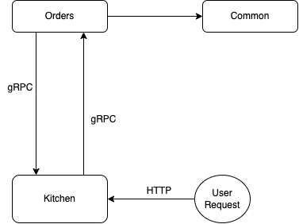

# gRPC Order Management Service

## Study and practice gRPC in Golang (Learning by doing)



## Set-up program

```bash
cd go-microservices
make run-orders
```

```bash
make run-kitchen
```

Then visit `http://localhost:1000/`
